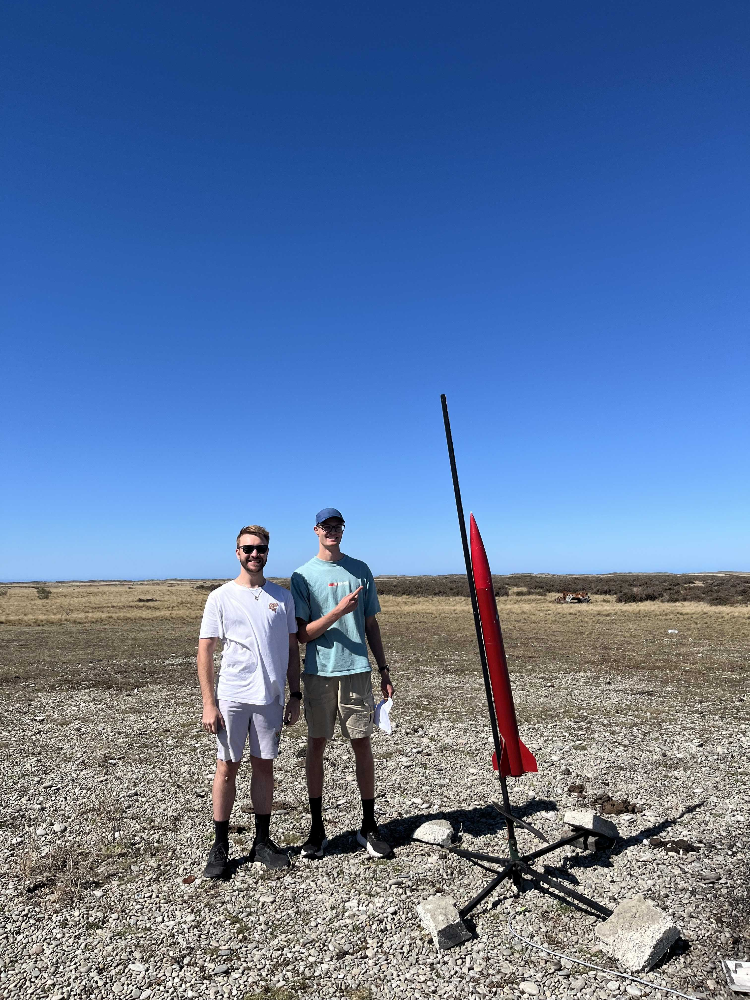
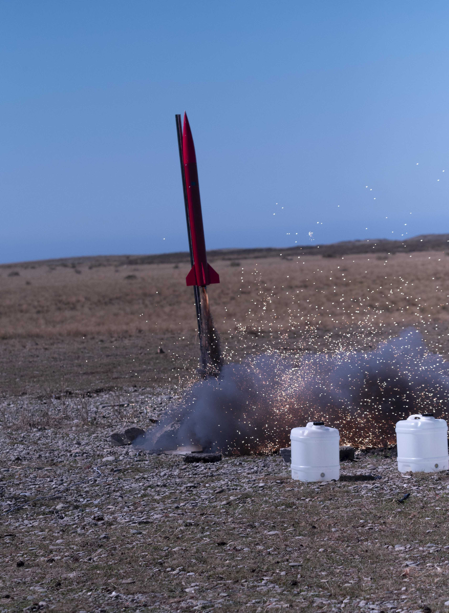
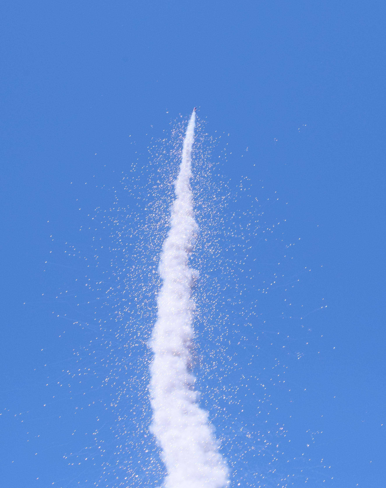

# Overview

Myself and Angus Eason modified a 1/4 scale Patriot rocket kit that I built in 2019.
We designed a custom flight computer, including its PCB, source code and mount.

Using an aftermarket solid motor, we launched the rocket on the 15th of February, after
obtaining permission from the land owner and a NOTAM.

Here follows some documentation on that journey.

Links:

- [FlightData](https://shaunlowis.github.io/rocketeering/flight_data)
- [Airframe](https://shaunlowis.github.io/rocketeering/airframe)
- [Motor](https://shaunlowis.github.io/rocketeering/motor)
- [Avionics](https://shaunlowis.github.io/rocketeering/avionics)
- [Software](https://shaunlowis.github.io/rocketeering/software)

