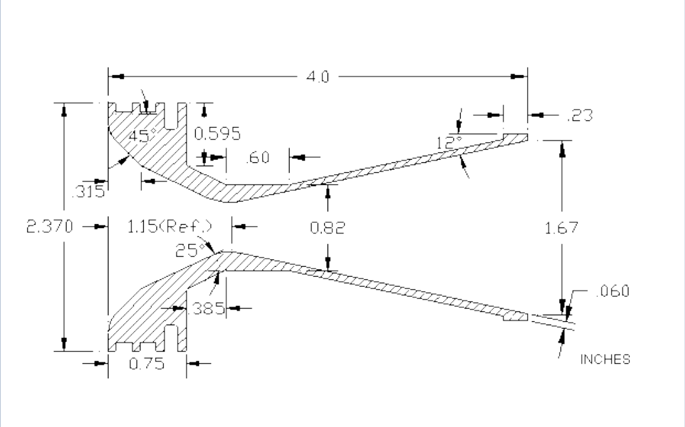

# Custom Motor 
## Overview
Take a [HP-I280DM DMS Rocket Motor](https://www.aerospaceeducation.co.nz/product/Motors_2C_High_Power_DMS-38mm/hpi280dm-dms-rocket-motor/471106). Specs:

```
Motor Type: SU
Delays: 6,8,10,12,14
Diameter: 38 mm
Length: 356 mm
Total Weight: 616 g
Prop. Weight: 355 g
Avg. Thrust: 280.0 N
Initial Thrust: 311.2 N
Max. Thrust: 386.0 N
Total Impulse: 561.0 Ns
Burn Time: 1.9 s
Propellant: Dark Matter
```

Make a custom nozzle. In theory, a nozzle made of carbon or some similar material that doesn't get burnt
during firing, will increase the impulse of the motor. This is because the motor made by the supplier
is designed to burn away alongside the solid fuel. In return for increased performance though, the motor
wall casing will become much hotter. Here I'll split things up into the classic design, build and test.

## Design

First an understanding of the solid fuel combustion process is needed. The nozzle:

- Directs and accelerate combustion gasses to high
velocities. Provides Choked flow to prevent
catastrophic erosive burning. (Going supersonic in
the propellant core)

- Goal is maximum thrust coefficient with minimum
nozzle weight.

- Nozzle throat area controls combustion chamber
pressure and divergent angle controls thrust
amplification through the coefficient of thrust.

A typical nozzle design:


#### References
[Practical APCP motor design](https://www.tripolimn.org/wp-content/uploads/2016/12/Practical-APCP-motor-design.pdf)

