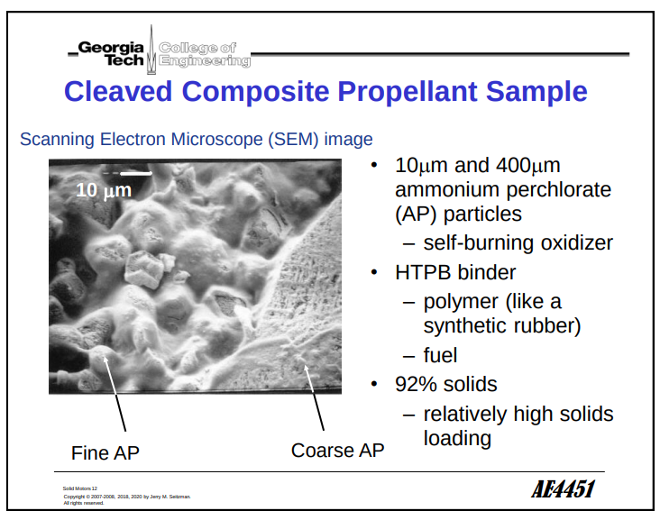
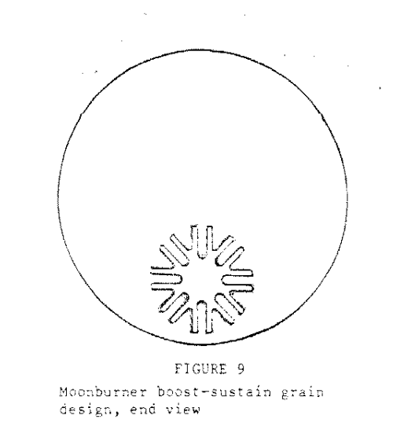
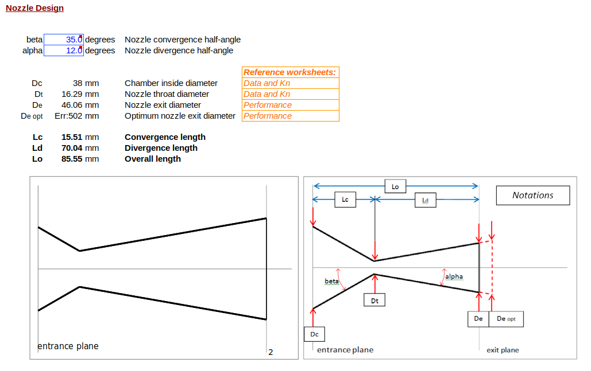

# Custom Motor

## COTS motor

[HP-I280DM DMS Rocket Motor](https://www.aerospaceeducation.co.nz/product/Motors_2C_High_Power_DMS-38mm/hpi280dm-dms-rocket-motor/471106). Specs:

```ascii
Motor Type: SU
Delays: 6,8,10,12,14
Diameter: 38 mm
Length: 356 mm
Total Weight: 616 g
Prop. Weight: 355 g
Avg. Thrust: 280.0 N
Initial Thrust: 311.2 N
Max. Thrust: 386.0 N
Total Impulse: 561.0 Ns
Burn Time: 1.9 s
Propellant: Dark Matter
```

## Custom motor

First an understanding of the solid fuel combustion process is needed. The nozzle:

- Directs and accelerate combustion gasses to high
velocities. Provides Choked flow to prevent
catastrophic erosive burning. (Going supersonic in
the propellant core)

- Goal is maximum thrust coefficient with minimum
nozzle weight.

- Nozzle throat area controls combustion chamber
pressure and divergent angle controls thrust
amplification through the coefficient of thrust.

A typical nozzle design:


The motor's length, inner and outer diameters are summarised here.

- The solid fuel motor has a hollow core, the interior area of which is th eburn area. The $K_n$ burning-area to throat-area ratio determines the combusiton chamber pressure.

- The longer the motor, the greater the erosive effect, due to more combustiongases flowing.

### Using the SRM excel sheet

[HP-I280DM](https://www.thrustcurve.org/simfiles/5f9244e11bca580004171750/)
Variables used:

- Inner diameter, `Dc` = 38mm
- Motor length, `Lc` = 356mm
- Propellant type = KNDX (see $^{note}$)
- Outer diameter, `Do` = 18mm
- Core diameter, `do` = 36mm (assumed casing thickness ~2mm)
- Segment length, `Lo` = `Lc` = 356mm (assumed 1 segment.)
- Number of segments, `N` = 1
- Target MEOP = 1000psi

$^{note}$
Details on the propellant type was quite difficult to find, as we are using a COTS motor. Perhaps a custom sugar motor might be an option for future launches. Regardless, a datasheet from RCS on the Metalstorm propellant for 38mm diameter solid motors is included in this repository, see:

`resource_files/motor/rcs_propellant_grain_msds_11014.pdf`

This mentions an Ammonium Perchlorate base with a rubber binder, which is usually HTPB. This is a typical solid fuel formulation shown below.

Credit to Georgia Tech


The AeroTech rockets use the "moonburner" grain design, shown here:


The SRM sheet (see `resource_files/motor/SRM_2023.xls`) is made for sugar motors, but I figured it would still
do an okay job of generating ballpark nozzle dimensions:



## References

[Practical APCP motor design](https://www.tripolimn.org/wp-content/uploads/2016/12/Practical-APCP-motor-design.pdf)

[Experimental Composite Propellant by Terry McCreary, PROPEL20.xls](https://aeroconsystems.com/product/experimental-composite-propellant)

[Solid Rocket Motor Design, Richard Nakka](https://www.nakka-rocketry.net/softw.html#SRM)

[Georgia Tech](https://seitzman.gatech.edu/classes/ae4451/solid_propellant_motors.pdf)


[Back to home site](https://shaunlowis.github.io/rocketeering/)